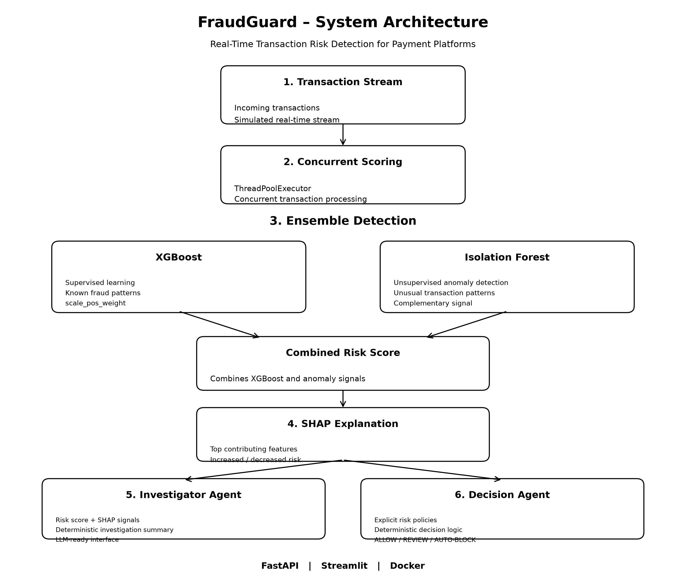

# FraudGuard

### Real-Time Transaction Risk Detection for Payment Platforms

FraudGuard is an end-to-end transaction risk detection system designed for payment-platform style workloads. It combines supervised learning for known fraud patterns with unsupervised anomaly detection for potentially novel patterns, while providing explainable risk signals for downstream decisions.

The system supports real-time transaction scoring, concurrent processing, SHAP-based explanations, and a modular Investigator + Decision agent architecture. It is exposed through a FastAPI REST API, visualized with Streamlit, and containerized with Docker.

---

## Problem Statement

Payment platforms process large volumes of transactions where risk detection must be accurate, responsive, and explainable.

A practical system needs to detect both known fraud patterns and unusual behavior, while providing enough context for support, investigation, and operational teams to understand why a transaction was flagged.

FraudGuard addresses this using a layered detection architecture combining supervised ML, anomaly detection, explainability, concurrent scoring, and deterministic decision logic.

---

## Architecture

FraudGuard follows a layered pipeline from transaction ingestion to operational decision-making.



### Detection Flow

```text
Transaction Stream
        ↓
Concurrent Scoring
        ↓
Ensemble Detection
   ┌────┴─────┐
XGBoost   Isolation Forest
   └────┬─────┘
        ↓
Combined Risk Score
        ↓
SHAP Explanation
        ↓
Investigator Agent
        ↓
Decision Agent
        ↓
ALLOW / FLAG FOR REVIEW / AUTO-BLOCK